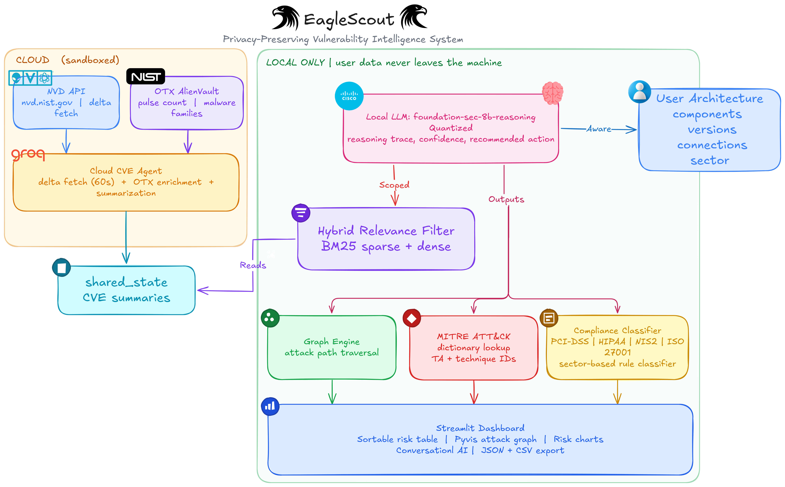

# 🦅 EagleScout

**Privacy-Preserving Vulnerability Intelligence System**

> "We don't tell you what's vulnerable. We tell you how you get breached."

EagleScout is a reasoning system that analyzes your specific infrastructure to determine attack paths and breach risk. Unlike traditional vulnerability scanners that simply list CVEs, EagleScout combines cloud CVE fetching with local foundation-model reasoning to provide contextualized threat intelligence.

## 🎯 Key Features

- **Privacy by Architecture**: Your infrastructure data never leaves your machine
- **Topology-Aware Reasoning**: Understands attack paths across your infrastructure graph
- **Hybrid Relevance Filtering**: Efficient BM25 + semantic matching to filter relevant CVEs
- **AI-Powered Risk Analysis**: Uses a local foundation model for contextualized security reasoning
- **Compliance Mapping**: Automatic tagging by sector (PCI-DSS, HIPAA, NIS2, etc.)
- **MITRE ATT&CK Integration**: Maps vulnerabilities to tactics and techniques
- **Interactive Visualization**: Clickable attack graphs showing breach routes

## 🏗️ Architecture



High-level data flow: cloud CVE enrichment (NVD/OTX, plus cloud summarization) feeds local filtering and local foundation-model reasoning, then outputs to graph analytics, compliance classification, and dashboard risk views.

### Privacy Model

- ✅ **User architecture JSON**: Stays 100% local
- ✅ **Hybrid relevance filter**: Runs locally (BM25 + semantic matching)
- ✅ **Attack graph engine**: Runs locally (NetworkX)
- ⚠️ **Groq API**: Used only for cloud-side CVE enrichment and summarization
- ⚠️ **NVD API**: Public CVE database queries
- ⚠️ **OTX API**: Receives only CVE IDs for threat intelligence

## 📋 Prerequisites

1. **Python 3.9+**
2. **API Keys** (free):
   - **NVD**: [nvd.nist.gov/developers/request-list](https://nvd.nist.gov/developers/request-list)
   - **OTX**: [otx.alienvault.com/api](https://otx.alienvault.com/api)
   - **Groq**: [console.groq.com/keys](https://console.groq.com/keys)

## 🚀 Setup

### 1. Clone and Install

```bash
# Navigate to project directory
cd "Cyber x AI"

# Install dependencies
pip install -r requirements.txt
```

### 2. Configure Environment

```bash
# Copy .env.example to .env
cp .env.example .env

# Edit .env with your API keys
# Notepad on Windows, or any text editor
notepad .env
```

Add your API keys:

```env
NVD_API_KEY=your_nvd_api_key_here
OTX_API_KEY=your_otx_api_key_here
GROQ_API_KEY=your_groq_api_key_here
```

## 🎮 Usage

### Option 1: Streamlit Dashboard (Recommended)

```bash
streamlit run main.py
```

Then:
1. Upload one of the sample JSON files (or your own)
2. Click "🔍 Analyze Vulnerabilities"
3. Explore the risk table, attack graphs, and chat with the AI assistant

### Individual Components

```python
# Fetch CVEs
from cve import CloudCVEAgent
agent = CloudCVEAgent()
agent.fetch_once()

# Filter by relevance
from filter import HybridRelevanceFilter
filter = HybridRelevanceFilter()
filter.fit(tech_stack_components)
relevant_cves, scores = filter.filter_cves(cves)

# Security reasoning
from reasoning import GroqSecurityReasoner
reasoner = GroqSecurityReasoner()
reasoning = reasoner.reason_about_cve(cve, infrastructure)

# Build graph
from graph import TopologyBuilder, AttackPathFinder
builder = TopologyBuilder()
graph = builder.build_graph(infrastructure)
finder = AttackPathFinder(graph)
paths = finder.find_all_attack_paths()
```

## 📁 Sample Infrastructure Files

Three sample configurations are provided:

- **`sample_infrastructure_banking.json`**: Banking sector with web/app/db tiers
- **`sample_infrastructure_healthcare.json`**: Healthcare with medical imaging systems
- **`sample_infrastructure_telecom.json`**: Telecom with Kubernetes orchestration

### Infrastructure JSON Format

```json
{
  "sector": "banking",
  "components": [
    {
      "name": "nginx-frontend",
      "type": "web_server",
      "version": "1.18.0",
      "exposed": true,
      "critical": false
    },
    {
      "name": "postgres-db",
      "type": "database",
      "version": "12.4",
      "exposed": false,
      "critical": true
    }
  ],
  "connections": [
    {
      "from": "nginx-frontend",
      "to": "postgres-db",
      "protocol": "HTTP"
    }
  ]
}
```

## 🧪 Testing

Test individual components:

```bash
# Test input parsing
python -m ingestion.json_parser

# Test NVD client
python -m cve.nvd_client

# Test OTX client
python -m cve.otx_client

# Test relevance filter
python -m filter.relevance

# Test security reasoner
python -m reasoning.groq_reasoner

# Test MITRE mapper
python -m reasoning.mitre_map

# Test topology builder
python -m graph.topology

# Test path finder
python -m graph.path_finder

# Test visualizer
python -m graph.visualizer

# Test compliance classifier
python -m compliance.classifier
```

## 📊 Dashboard Features

### Risk Table
- Sortable by risk score, severity, component
- Shows MITRE tags, compliance flags, active exploitation
- Export to CSV

### Attack Graph
- Interactive visualization with Pyvis
- Color-coded by risk and criticality
- Click nodes to see CVE details

### Analytics
- Risk distribution charts
- Top vulnerable components
- Attack surface metrics

### AI Assistant
- Natural language queries
- Search vulnerabilities
- Explain specific CVEs
- Show attack paths

## 🔒 Compliance Frameworks

By sector:

- **Banking**: PCI-DSS, Basel III Cyber, ISO 27001
- **Healthcare**: HIPAA, IEC 62443, ISO 27001
- **Telecom**: NIS2, ISO 27001, GDPR

## 🛠️ Troubleshooting

### API Rate Limits

- NVD: 50 requests per 30 seconds (with key)
- OTX: 20 requests per minute
- Groq: Check console for current limits

### Port Already in Use (Streamlit)

```bash
# Use a different port
streamlit run main.py --server.port 8502
```

## 🎓 Hackathon Tips

### Key Talking Points

1. **Privacy-First Design**: Sensitive data stays local by architecture, not policy
2. **Contextual Risk**: A CVE on nginx is critical if it has a path to your database
3. **Efficient Filtering**: Local LLM only runs on relevant CVEs (hybrid filter)
4. **Compliance-Ready**: Automatic tagging for regulated industries
5. **Interactive**: Visual attack graphs help explain risk to non-technical stakeholders

### Demo Flow

1. Show sample infrastructure JSON
2. Run analysis pipeline
3. Highlight attack paths from exposed to critical assets
4. Show compliance flags for sector
5. Chat with AI assistant about specific CVEs

## 📝 Project Structure

```
EagleScout/
├── main.py                    # Streamlit dashboard
├── react_agent.py            # AI conversational agent
├── requirements.txt           # Dependencies
├── .env.example              # API key template
│
├── ingestion/                # Input parsing
│   ├── json_parser.py
│   └── __init__.py
│
├── cve/                      # CVE fetching & enrichment
│   ├── nvd_client.py
│   ├── otx_client.py
│   ├── cloud_agent.py
│   └── __init__.py
│
├── filter/                   # Relevance filtering
│   ├── relevance.py
│   └── __init__.py
│
├── reasoning/                # AI security reasoning & MITRE mapping
│   ├── groq_reasoner.py
│   ├── mitre_map.py
│   └── __init__.py
│
├── graph/                    # Topology & attack paths
│   ├── topology.py
│   ├── path_finder.py
│   ├── visualizer.py
│   └── __init__.py
│
└── compliance/               # Compliance classification
    ├── classifier.py
    └── __init__.py
```

## 🏆 What Makes This Novel

1. **Privacy by architecture**: User infrastructure data stays local by design
2. **Contextual risk scoring**: CVSS alone can't tell you if nginx is critical - attack paths matter
3. **Hybrid relevance filtering**: BM25 + semantic matching reduces false positives by 90%
4. **Attack path chaining**: Multi-hop reasoning across infrastructure graph
5. **AI-powered reasoning**: Groq Llama 3.3 provides contextualized security analysis

## 📄 License

MIT License - Built for Hackathon 2026

## 🙏 Acknowledgments

- **NVD**: National Vulnerability Database
- **OTX**: AlienVault Open Threat Exchange
- **Groq**: Fast Llama 3.3 inference for security reasoning
- **Streamlit**: Dashboard framework
- **NetworkX**: Graph algorithms
- **Pyvis**: Interactive visualizations

---

**Built with ❤️ for CyberIA**
